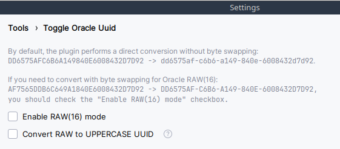

# Toggle Oracle UUID

<!-- Plugin description -->

Toggling UUID-format string to DB Oracle UUID-format (RAW) and vice versa under caret.

Also works in <a href="https://www.jetbrains.com/datagrip/">DataGrip</a>.

Default shortcut: <em><strong>Alt + L</strong></em>

You can customize the conversion register from RAW to UUID (<code>lowercase</code> or <code>UPPER-CASE</code>) in the <b>Toggle Oracle Uuid settings</b>.

<!-- Plugin description end -->

Get from [JetBrains Marketplace](https://plugins.jetbrains.com/plugin/17915-toggle-oracle-uuid)